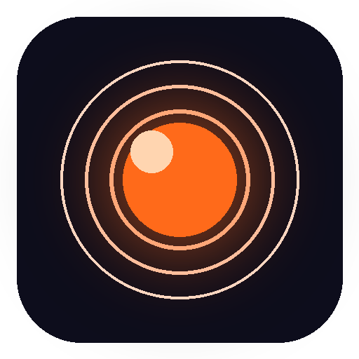
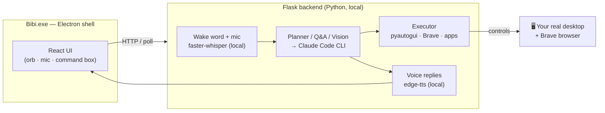

<p align="center">
  
</p>

<h1 align="center">Bibi</h1>

<p align="center">
  <b>A local-first, voice-controlled AI that actually runs your Windows PC.</b><br/>
  Say <i>"Bibi"</i> (or tap the mic) and it opens apps, searches inside YouTube / Crunchyroll / Amazon,
  clicks what's on your screen, and answers anything out loud — powered by Claude, running on your machine.
</p>

<p align="center">
  <a href="LICENSE"></a>
  
  
  
  
  <a href="https://github.com/sharique2004/pc-assistant/stargazers"></a>
</p>

---

## 🎬 See it in action

<video src="https://github.com/sharique2004/pc-assistant/raw/main/docs/bibi-demo.mp4" poster="https://github.com/sharique2004/pc-assistant/raw/main/docs/bibi-poster.jpg" controls width="100%"></video>

> ▶️ **[Watch the 40‑second demo](docs/bibi-demo.mp4)** (if the player above doesn't load) — Bibi running a real Windows desktop, by voice.

A session looks like this:

> 🗣️ *"Bibi… open YouTube and play the first video."* → opens YouTube, searches, clicks the result.
> 🗣️ *"Search Amazon for noise-cancelling headphones."* → goes straight to Amazon's results.
> 🗣️ *"How is glass made?"* → answers out loud, like ChatGPT.
> ⌨️ Type the same things if you'd rather not talk.

---

## ✨ What makes Bibi different

Most "AI computer use" demos drive a sandbox or a cloud VM. **Bibi drives _your_ real machine** — your apps, your Brave browser, your screen — and it's **voice-first** and **local-first**.

- 🎙️ **Voice or type** — wake word *"Bibi"*, push-to-talk mic, or the command box. Speaks replies back.
- 🖥️ **Real desktop control** — moves your actual mouse/keyboard, opens apps, types, and clicks what it *sees* on screen (screenshot → Claude vision → click).
- 🔎 **Smart on-page search** — already on YouTube/Crunchyroll/Netflix/Amazon? Just say *"search for Frieren"* and it uses **that site's** search, not a random web search.
- 🧠 **Claude as the brain** — planning, Q&A, vision, and code-gen run through the Claude Code CLI you already have.
- 🔒 **Local-first & private** — speech-to-text (Whisper) and text-to-speech run **on your machine**; only the reasoning goes to Claude. No always-on cloud mic.
- 📦 **A real native app** — ships as `Bibi.exe` (Electron). Open = on, close = off. Not a browser tab.
- 📓 **Remembers its day** — keeps an Obsidian-style journal of everything it did.

---

## 🧩 Capabilities

| You say / type… | Bibi does… |
|---|---|
| "open youtube" / "open chatgpt" | Launches the site/app instantly |
| "search amazon for a mechanical keyboard" | Goes to Amazon's own search results |
| "play the second video" (on a results page) | Clicks the 2nd item it sees on screen |
| "book a flight to Dubai" | Opens the search and drives toward checkout |
| "what's the weather in Tokyo?" | Real, live answer — spoken aloud |
| "summarize what's on my screen" | Looks at your screen and explains it |
| "remember my LinkedIn is …" | Stores it; later "open my LinkedIn" uses *your* URL |

---

## ✅ What you'll need (this is a power-user tool — be honest with yourself)

| Requirement | Why |
|---|---|
| **Windows 11** | Uses native Windows mouse/keyboard/screen control |
| **[Claude Code CLI](https://docs.claude.com/en/docs/claude-code) installed & signed in** | This is Bibi's *brain* (a Claude Pro/Max plan or API). You bring your own. |
| **Python 3.11+** | The backend (speech, control, server) |
| **Node.js 18+** | To build the React UI + the Electron app |
| **Brave browser** | Bibi opens sites here (your real, logged-in browser) |
| **A microphone** | For voice (optional — typing works without it) |

> 💡 No Claude plan? Bibi can be pointed at a local LLM (Ollama) or Gemini for some paths, but the best experience is Claude.

---

## 🚀 Quick start (run from source)

```powershell
# 1. Clone
git clone https://github.com/sharique2004/pc-assistant.git
cd pc-assistant

# 2. Backend (Python)
python -m venv .venv
.\.venv\Scripts\Activate.ps1
pip install -r requirements.txt
copy backend\.env.example backend\.env      # tweak if you like

# 3. Frontend (React) — build the UI
cd frontend && npm install && npm run build && cd ..

# 4. Desktop app (Electron)
cd desktop && npm install
npm start                                    # launches Bibi (it starts the backend itself)
```

The Bibi window opens, the **"Bibi"** wake word turns on, and you can type or talk.

**Make a one-click app + Start-Menu shortcut:**
```powershell
cd desktop && npm run dist          # builds Bibi.exe (win-unpacked)
..\install_bibi_app.ps1             # adds "Bibi" to Desktop + Start Menu with the orb icon
```

> Tip: tell Bibi who you are once — `remember my name is …`, `remember my linkedin is …` — and it personalizes.

---

## 🏗️ How it works



- **Shell:** Electron (`desktop/`) — reliable input, grants the mic, no browser chrome.
- **Backend:** Flask (`backend/`) — wake word, push-to-talk, planning, screen control, TTS.
- **Brain:** the **Claude Code CLI** (planning, answers, screen vision, code-gen).
- **Local bits:** `faster-whisper` (speech→text), `edge-tts` (text→speech), `pyautogui` + Claude vision (screen control).

---

## 🔐 Security & privacy

Bibi can move your mouse, read your screen, type, and open apps — so **transparency matters**, which is exactly why it's open source: read the code before you run it.

- Speech recognition and voice synthesis run **locally**. Your reasoning prompts go to **Claude** (your own account).
- It **never auto-sends** emails/messages — it opens a pre-filled draft for you to review.
- It **won't close** windows or take irreversible actions unless you explicitly ask.
- Your personal profile lives in `data/` (gitignored) — it never leaves your machine.

---

## 🗺️ Roadmap

- [ ] Cross-platform (macOS / Linux) — the biggest unlock
- [ ] "Structured-first" control: deep-link / keyboard / UI-Automation before vision (more reliable, faster)
- [ ] Optional local grounding model (UI-TARS / OmniParser) for fully-offline clicking
- [ ] Anthropic-API option instead of the CLI (faster, bring-your-own-key)
- [ ] One-click signed installer

---

## 🤝 Contributing

PRs, issues, and ideas are all welcome. Good first areas: new site-search templates, voice tuning, cross-platform shims. Please keep personal data out of commits (`data/`, `.env`, and journals are gitignored for a reason).

## 📄 License

[MIT](LICENSE) © Sharique Khatri

---

<p align="center">
  <b>If Bibi is cool to you, a ⭐ genuinely helps it reach more people.</b>
</p>
